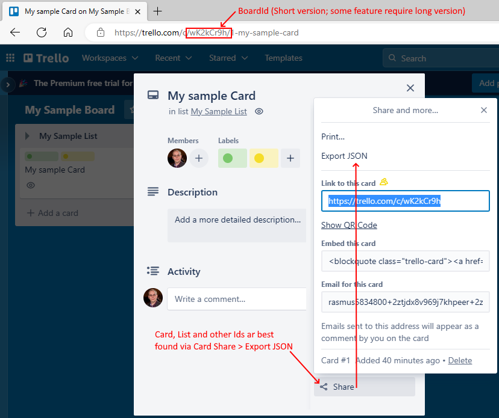
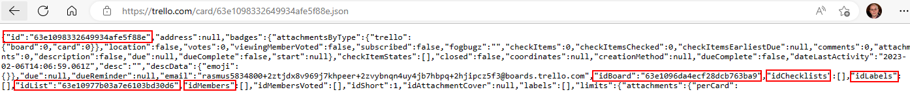

# TrelloDotNet
.NET Implementation of the Trello API

## Version History
- [Read the changelog here](Changelog.md)

## NuGet Options
- Search for 'TrelloDotNet' in Package Manager
- Install via .NET CLI
```shell
dotnet add package TrelloDotNet
```

## Handy Links from Trello
- Link to the page where you get your API Key and Token: https://trello.com/power-ups/admin/
- Link to Rest Api documentation from Trello: https://developer.atlassian.com/cloud/trello/rest

## Quick examples to get going:

```cs
TrelloClient client = new TrelloClient("APIKey", "TOKEN");

//Get a board
Board board = await client.GetBoardAsync("<boardId>");

//Get Lists on a board
List<List> lists = await client.GetCardsOnBoardAsync("<boardId>");

//Get a card
Card card = await client.GetCardAsync("<cardId>");

//Add a card
var input = new Card("<listId>", "My Card", "My Card description");
//todo - add more about the card 
var newCard = await client.AddCardAsync(input);

//Add a Checklist to a card
var checklistItems = new List<ChecklistItem>
{
    new("ItemA"),
    new("ItemB"),
    new("ItemC")
};
var newChecklist = new Checklist("Sample Checklist", checklistItems);
var addedChecklist = await client.AddChecklistAsync("<cardId>", newChecklist);

```

## On the subject of getting Ids from Trello
- The easiest way to get Ids in Trello is to use the API itself or use the share buttons in the project



The Export looks like this (search for id or use a tool to pretty-print the JSON to get a better view)



## More info, bugs, or questions?
Visit the Github Page: https://github.com/rwjdk/TrelloDotNet

*Have Fun* :-)
